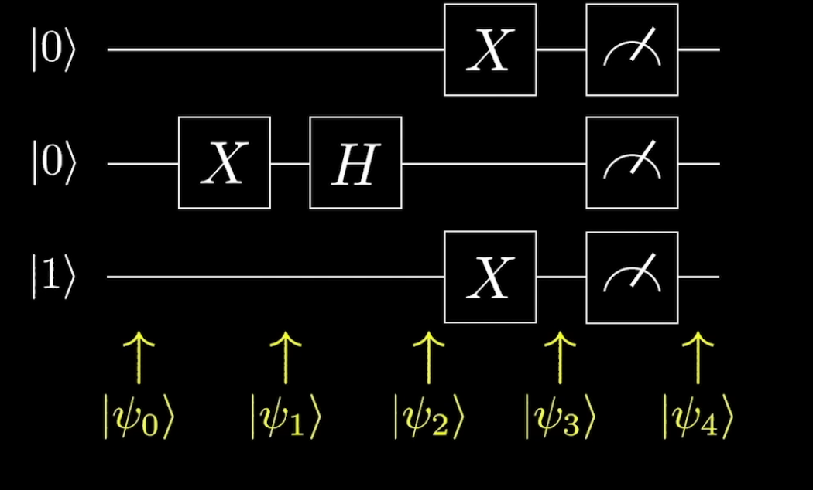

# complex numbers in QC(quantum computing)

## representing complex numbers as exponents

$re^{i\theta}  $

# MAtices and quantum states

* transposing a matrix is switching the rows and colums

# Qubits

> It can be any particle with a state

> Superposition - being in 2 positions at once (being 0 and 1 at once)

$$|\psi\rangle = \left (\begin{array}{c} \alpha \\ \beta \end{array} \right)$$

$|\alpha|^2 + |\beta|^2  = 1$

$\alpha$ - how much the qbit is in the $|0\rangle state$

$\beta$ - how much the qbit is in the $|1\rangle state$

# Dirac Notation

$$|\psi\rangle = \left (\begin{array}{c} \alpha \\ \beta \end{array} \right) = \alpha |0\rangle + \beta |1 \rangle$$

# Representing q bits graphically

# Reprezenting Phase

> Phase is switching the orientation of the vector insde the qbit

 $\alpha |0\rangle + e^{i\phi}\beta |1 \rangle$ - rotatig along the z axis by $\phi radians$

## Global Phase
> when all the states are multiplied by the Phase

 $ e^{i\phi}\alpha |0\rangle + e^{i\phi}\beta |1 \rangle$ 
## Relative Phase
> when just the one state is multiplied by the complex number

 $\alpha |0\rangle + e^{i\phi}\beta |1 \rangle$ 

> probability of measuring 0 = $|\alpha|^2$

> probability of measuring a 1 = $|e^{i\phi} \beta|^2$

#Gates

## Hadamart gate 
$$|0\rangle \rightarrow |+\rangle \rightarrow |0\rangle$$

$$|1\rangle \rightarrow |-\rangle \rightarrow |1\rangle$$
# Tensor products

$$|0\rangle \bigotimes |0\rangle = |00\rangle$$

$|1\rangle ^{\bigotimes 5} = |11111\rangle$

# Quantum circuits

## Stern-Garlac Eperiment

## Physics implementation

## Gates
> Althought quantum gates are probabilistic they are reversable
### CNOT 

>if the control cubit is 1 then the X gate will be aplied to the target qbit

> Works basically like a XOR gate

### CCNOT
> AND gate for qbits    
### Toffoli Gates

> It does the same as the CNOT gate but takes 2 control qbits

# Kroniker products

# Generating Quantum entanglment with Gates

